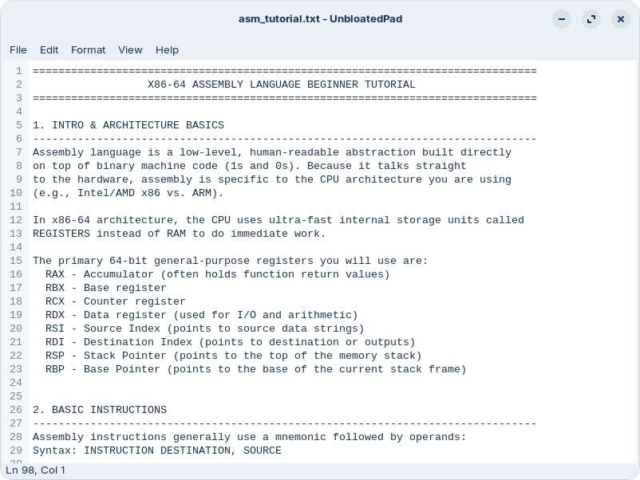

<div align="center">
  

  # 📝 UnbloatedPad

  ### A classic Notepad-style text editor for Linux — written **entirely in hand-typed x86-64 assembly** 🤯

  [](#-architecture)
  [](#-requirements)
  [](#-requirements)
  [](LICENSE)
  [](#-build)

  

</div>

---

## 🧵 What is this?

**UnbloatedPad** (`upad`) is a Linux/GTK4 + libadwaita port of
[TinyRetroPad](https://github.com/davepl/TinyRetroPad), the Win32/MASM
project by Dave Plummer and Matt Power. Same spirit — **no C glue code
anywhere** — but unlike the original, this port doesn't chase a minimal
byte count. The goal is a correct, readable, maintainable GTK4
application that just so happens to call straight into the `libgtk-4` /
`libadwaita-1` / `libgio-2.0` / `libgobject-2.0` C ABI from raw assembly.

GCC shows up exactly once, as the link driver, so the binary gets a
normal glibc CRT startup (`_start`, TLS, `malloc`, pthreads) — GTK/GLib
need that fully initialized libc regardless. Every line of *editor
logic* above that point is 🔧 hand-written NASM.

## ✨ Features

A faithful, fully-working Notepad clone:

| Menu | What's in it |
|---|---|
| 📄 **File** | New · Open... · Save · Save As... · Page Setup... · Print... · Exit |
| ✂️ **Edit** | Undo · Cut · Copy · Paste · Delete · Find... · Find Next · Replace... · Go To... · Select All · Time/Date |
| 🎨 **Format** | Word Wrap · Font... |
| 👁️ **View** | Status Bar · Dark Mode · Line Numbers |
| ❓ **Help** | View Help (opens this repo) · About UnbloatedPad |

Plus the details that make it feel like a real app, not a toy:

- 🖨️ **Real printing** — Page Setup + Print, with proper Pango-based
  pagination across as many pages as your document needs.
- 🚨 **Error dialogs that actually tell you something** — a failed
  open/read/write pops a real alert *and* logs it (journal/stderr) for
  later digging.
- 🌍 **Opens legacy (non-UTF-8) text files** instead of silently loading
  them as empty — transcodes from Windows-1252 automatically, and asks
  once, on Save, whether to keep that original encoding or convert to
  UTF-8.
- 🔢 **A line-numbers gutter, on by default** — the gutter width tracks
  the document's line count in real time (1 digit for a new file, growing
  as needed), at effectively zero cost regardless of file size: editing a
  10,000,000-line file feels the same as editing a 100-line one, since
  the per-keystroke check is O(1) and the actual resize only happens the
  handful of times the digit count itself changes.
- 🌗 **Dark Mode**, a live "Ln X, Col Y" status bar, and all the
  keyboard shortcuts you'd expect (`Ctrl+N/O/S`, `Ctrl+Shift+S`, `Ctrl+F`,
  `F3`, `Ctrl+H`, `Ctrl+G`, `F5`, ...).

## 👤 Author

This Linux port (renamed **UnbloatedPad**, distinct from the Windows
**TinyRetroPad** it's ported from) was created by **Tiglate Pileser III**
(`tiglate`), written with 🤖 **Claude (Anthropic)** acting as the
assembly author under his direction. The original Windows/MASM
TinyRetroPad this is ported from is by Dave Plummer and Matt Power.

## 🧰 Requirements

- **NASM** (`nasm`) — the assembler doing all the real work
- **GCC** (`gcc`) — link driver only (see above)
- **`pkg-config`**
- **GTK4 development headers** (`libgtk-4-dev` on Debian/Ubuntu)
- **libadwaita development headers, 1.5+** (`libadwaita-1-dev`) — the
  Font/Find/Replace/Go To/Print dialogs and Help > About all lean on
  APIs introduced in GTK 4.10 and libadwaita 1.5

On Debian/Ubuntu/Zorin:

```bash
sudo apt-get install nasm build-essential pkg-config libgtk-4-dev libadwaita-1-dev
```

## 🔨 Build

```bash
make          # -> ./upad
make run      # build (if needed) and launch it
make clean    # remove build/ and the upad binary
make release  # clean rebuild, then strip debug info -> a leaner ./upad
```

Each `src/*.asm` is assembled independently (`nasm -f elf64 -g -F dwarf`)
into `build/*.o`, then linked in one step against
`$(pkg-config --libs gtk4 libadwaita-1)`.

The default build keeps DWARF debug info (handy for `gdb`), which makes
up a big chunk of the binary on disk even though it's never loaded into
memory at runtime. `make release` does a clean rebuild and strips it —
📉 **~58% smaller** (115KB → 49KB as of this writing), no behavior change.

🔖 The version number has exactly one home: the `.version` file at the
repo root — not the Makefile, not any `.asm` file. It feeds both `.deb`
packaging and the About dialog (via a small generated `build/version.inc`
`src/about.asm` includes). Bump it by editing `.version`, nothing else.

### 🩹 Troubleshooting

**`pkg-config could not find "gtk4 libadwaita-1"`** even though the -dev
packages are installed: some setups don't have
`/usr/lib/<arch>/pkgconfig` in `PKG_CONFIG_PATH` by default. Find the
`.pc` files and point at them:

```bash
find /usr/lib -name 'gtk4.pc'
export PKG_CONFIG_PATH=/usr/lib/x86_64-linux-gnu/pkgconfig   # adjust to what `find` printed
make
```

**`ld: relocation ... in read-only section '.text'` / `undefined
reference`**: a symbol referenced with `ICALL` (see `src/callconv.inc`)
isn't `global` in the file that defines it. `ICALL` is for calling this
program's *own* functions across files (no PLT indirection); `CCALL` is
for external GTK/GLib/libadwaita/libc functions.

## 🚀 Run

```bash
./upad                 # blank "Untitled" document
./upad somefile.txt    # opens somefile.txt directly
```

## 📦 Install / Package

```bash
sudo make install                # installs to /usr/local (binary + .desktop launcher + icon)
sudo make uninstall               # removes everything make install put down
make deb                          # builds upad_<version>_amd64.deb (installs under /usr)
```

Both `install` and `deb` always build through `release` first, so what
actually ships is the stripped binary, never the debug one.

📦 Publishing a [GitHub Release](../../releases) also builds and attaches
`upad_<version>_amd64.deb` automatically — see
`.github/workflows/publish-deb.yml`.

`PREFIX`/`DESTDIR` behave the usual way if you'd rather stage or
redirect the install. Once installed, `org.unbloatedpad.Editor.desktop`
shows up in your launcher and in "Open With" for text files, icon and
all. 🐧

## 🏗️ Architecture

One file per feature area — no byte-count pressure keeping things
crammed together, unlike the original:

| File | Owns |
|---|---|
| `main.asm` | Process entry point (`main`), `AdwApplication` setup, `activate`/`open` signal wiring |
| `window.asm` | Builds the window/menu bar/text view/status bar; dispatches `activate` and `open` (command-line file) signals |
| `menu.asm` | The File/Edit/Format/View/Help `GMenu` model (with real section separators), wrapped in a `GtkPopoverMenuBar` |
| `actions.asm` | Registers every `GAction` (`win.*` / `app.*`) and points it at its handler |
| `fileio.asm` | New/Open/Save/Save As: `GtkFileDialog` for the picker, raw `open`/`read`/`write`/`close` for the bytes |
| `encoding.asm` | 🌍 Transcodes non-UTF-8 files (assumed Windows-1252) to UTF-8 on load via `g_convert`; asks once, on Save/Save As, whether to keep the original encoding or convert to UTF-8 |
| `errdlg.asm` | 🚨 `report_error`/`report_file_error`: a `GtkAlertDialog` for the user, `g_log` (journal/stderr) for later examination |
| `printing.asm` | 🖨️ File > Page Setup.../Print..., via `GtkPageSetup`/`GtkPrintSettings` and `GtkPrintOperation`'s begin-print/draw-page/end-print signals (Pango layout pagination + cairo drawing) |
| `editops.asm` | Undo/Cut/Copy/Paste/Delete/Select All (GTK's own built-in text widget actions) + Time/Date |
| `finddlg.asm` | Find, Replace, and Go To Line dialogs and the search logic behind them |
| `format.asm` | Word Wrap, Font (via `GtkFontDialog`, applied as hand-built CSS), Dark Mode |
| `statusbar.asm` | The "Ln X, Col Y" status bar |
| `linenum.asm` | 🔢 View > Line Numbers (on by default): a `GtkDrawingArea` dropped into the text view's own gutter (`gtk_text_view_set_gutter`), hand-drawn per visible line with Pango/cairo |
| `unsaved.asm` | Tracks unsaved changes; interposes a Save/Discard/Cancel prompt in front of New/Open/Quit/window-close |
| `about.asm` | Help > View Help (opens this repo) and Help > About, via `AdwAboutDialog` (version field from generated `build/version.inc`) |
| `accels.asm` | Keyboard accelerators (`Ctrl+N`, `F3`, ...) for actions with no built-in GTK binding |
| `consts.inc` | Every enum/flag/struct-layout constant, each sourced from the installed system headers (see the comment above each block) |
| `extern.inc` | `extern` declarations for every GTK/GLib/libadwaita/Pango/cairo/libc function called from assembly |
| `callconv.inc` | The System V AMD64 calling-convention discipline every function follows (see below) |

### ⚙️ Calling convention

Every function keeps `rsp` 16-aligned before each `call`, per the SysV
AMD64 ABI (`push rbp` / `mov rbp, rsp` / `sub rsp, N` with `N` always a
multiple of 16). Two macros wrap `call`:

- **`CCALL`** — for external functions (GTK/GLib/libadwaita/Pango/cairo/
  libc), via their PLT stub (`call foo wrt ..plt`, required for a PIE
  executable), with `AL` zeroed first (the "0 vector registers used"
  contract that matters for the handful of variadic calls in the
  codebase, like `g_log`).
- **`ICALL`** — for this program's *own* functions defined in another
  `.asm` file (no PLT indirection needed).

Widget pointers that need to survive a nested call are always stashed in
a `g_*` global (`.bss`) or a genuine `[rbp-N]` stack slot immediately —
never left sitting in a caller-saved register across a `call`, since any
call is free to clobber those.

`printing.asm` is the one place this program passes/receives
floating-point values (`double`s, via cairo and `GtkPrintContext`) — they
go straight into/out of `XMM0`/`XMM1`/... like any other argument or
return value; `CCALL`'s `AL`-zeroing is unrelated to that and simply
doesn't apply to those (non-variadic) calls.

### 📐 Struct layouts

A couple of GTK/GLib structs are stack-allocated directly from assembly
and their exact byte layout matters. Both were verified with `sizeof`/
`offsetof` against the real installed headers on the build machine (see
`consts.inc`), not guessed from documentation:

- `GtkTextIter` — 80 bytes, opaque, documented by GTK as safe to
  stack-allocate at a fixed size.
- `GActionEntry` — 64 bytes (5 pointer-sized fields + 3 reserved/padding).

If you build against a GTK/GLib old or new enough that either changed,
re-verify with a two-line C program before trusting these constants.

## ⚠️ Known limitations

- 🌍 **No real charset auto-detection** — on a UTF-8 validation failure,
  `encoding.asm` always assumes Windows-1252, a deliberate simplification
  (it's a strict superset of Latin-1 for every printable character, and
  what most "old non-UTF-8 text file" turns out to be). A file in some
  other legacy encoding will decode as garbage rather than correctly,
  though never crash or silently stay empty. The Convert/Keep-original
  choice is also only asked once per document per session.
- 🖋️ **Printing** always uses the last Format > Font... pick (or
  "Monospace 11" if none) for the whole document — there's no separate
  print-only font/size, and no header/footer/page-number support.
- 🌗 **Dark Mode**: forcing *light* isn't guaranteed to fully override a
  desktop whose configured GTK theme is itself an always-dark theme (as
  opposed to using stock Adwaita's own light/dark pair) — see the comment
  above `on_dark_mode_activate` in `format.asm` for why.
- 💾 A short `write()` (fewer bytes written than the buffer's length) is
  still treated as success — only a hard failure (return value < 0) goes
  through `errdlg.asm`'s error dialog/log path.
- 🔁 **Replace All + unsaved-changes Save**: if you answer "Save" on the
  unsaved-changes prompt and the document has never been saved before,
  the ensuing Save As is asynchronous and the New/Open/Quit you originally
  asked for is dropped rather than chained after it completes — save,
  then repeat the action.
- 🔢 The line-numbers gutter always draws in a fixed mid-gray, not a
  theme-aware color — chosen to stay readable in both light and dark mode
  without extra plumbing.

---

<div align="center">

Made with 🧡 (and a lot of `mov`/`call`) for anyone who thinks a text
editor doesn't need a runtime.

</div>
